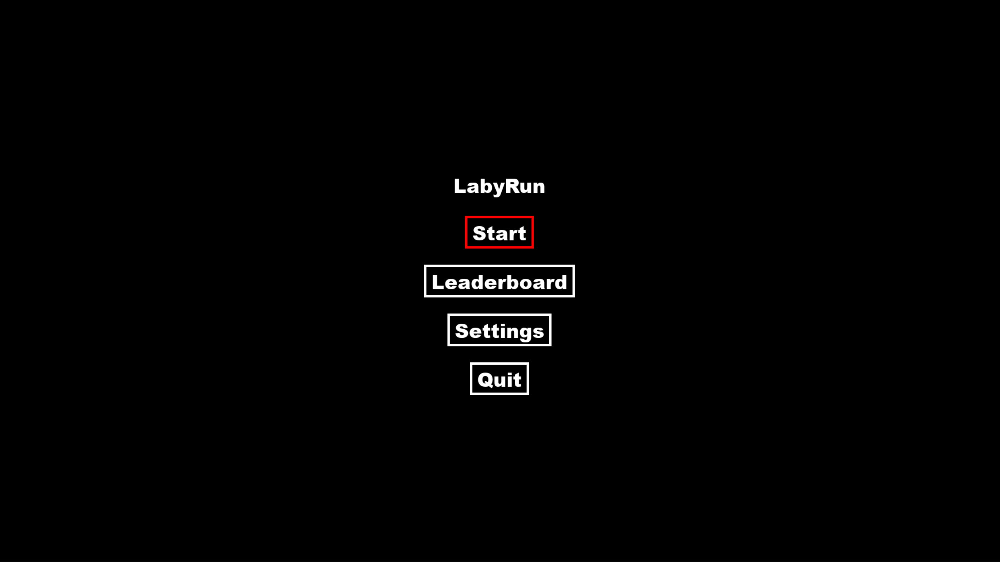
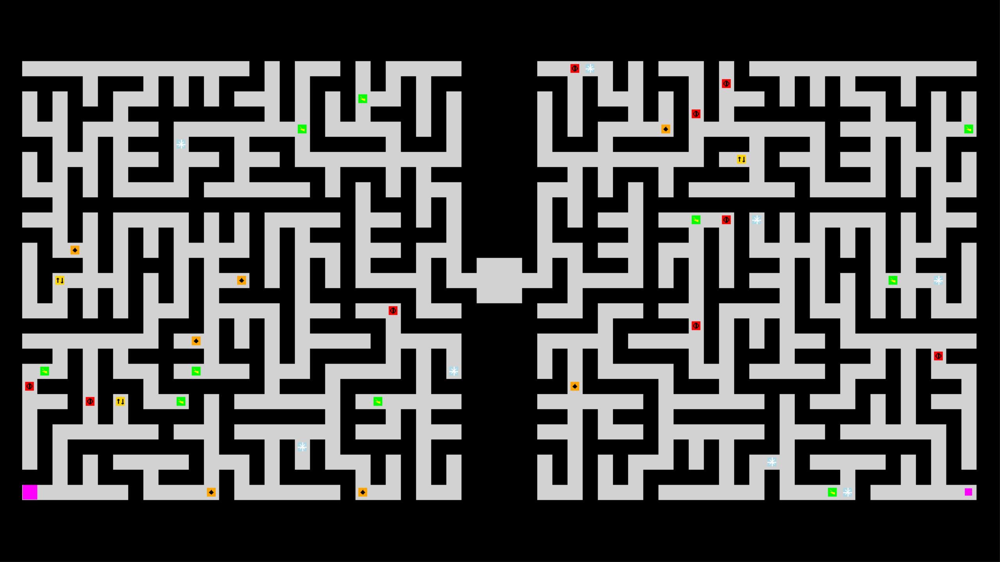
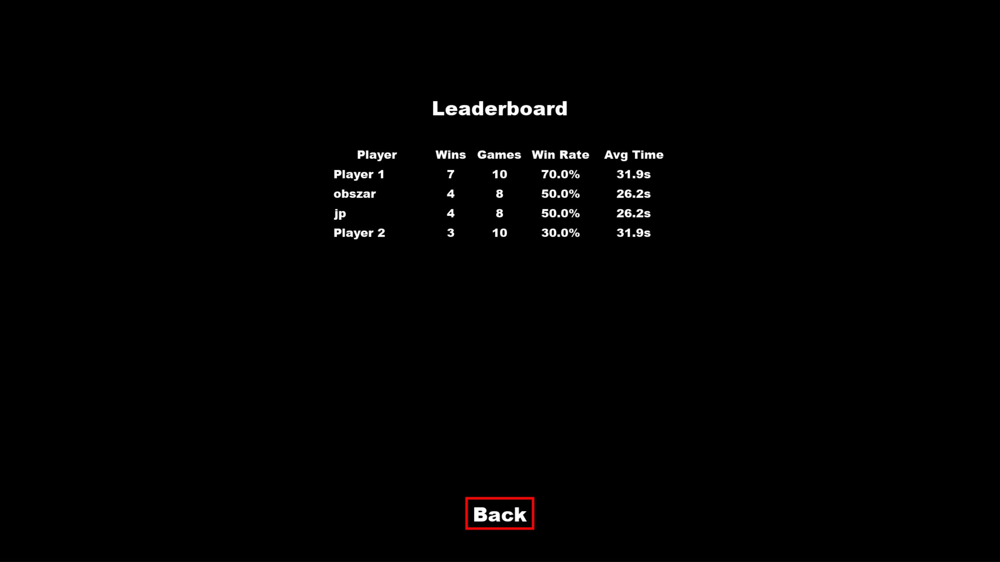

# LabyRun

LabyRun is a 2D maze race game built with Python and `pygame`.
Two players start on opposite sides of a mirrored maze and race towards the treasure in the center, using power-ups and dealing with random events along the way.

### Authors

- [Jakub Psarski](https://github.com/psarsky)
- [Paweł Czajczyk](https://github.com/Pawo0)

---

## Table of contents

- [Game overview](#game-overview)
- [Screenshots](#screenshots)
- [How to run](#how-to-run)
- [Main features](#main-features)
- [Power-ups](#power-ups)
- [Random events](#random-events)
- [Stats & leaderboard](#stats--leaderboard)

---

## Game overview

- Two players race through a maze to reach the middle win zone.  
- The maze is mirrored, so both players have to find the same path.  
- Power-ups and random global events dynamically change the rules mid-race.  

---

## Screenshots

### Main menu



### Gameplay (maze view)



### Leaderboard



---

## How to run

### Requirements

- Python 3.10+
- `pygame` library

### Install dependencies

```powershell
pip install pygame
```

### Start the game

In the project root directory:

```powershell
python main.py
```

---

## Main features

1. **Procedurally generated maze** – a new random maze is created for each game.
2. **Two-player local race** – both players compete on the same keyboard and screen.
3. **Map power-ups** – temporary bonuses and penalties that affect you or your opponent.
4. **Random global events** – short events that make the race less predictable.
5. **Menus, settings and leaderboard** – simple UI to start the game, tune options and view best players.

---

## Power-ups

Power-ups are items placed in the maze that temporarily change how players move or interact:

- Speed boosts and slows  
- Size changes  
- Teleports  
- Freezing and reversed controls

---

## Random events

From time to time, short global events change the rules for both players, for example:

- Harder-to-see walls  
- Temporary shortcuts in the maze  
- Sudden teleports  
- Slower movement for both players

---

## Stats & leaderboard

The game tracks how many matches each player has played and won, as well as basic timing information, and shows a simple leaderboard with the best results.
